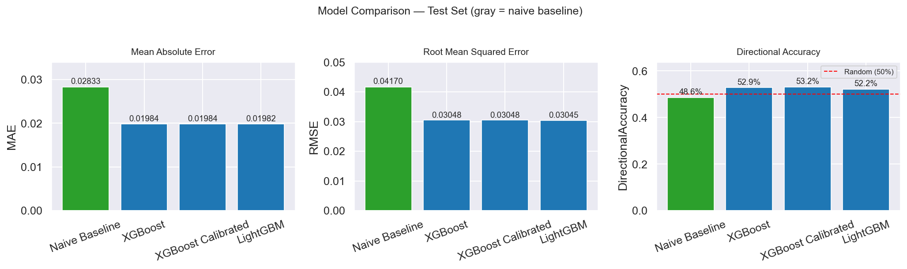
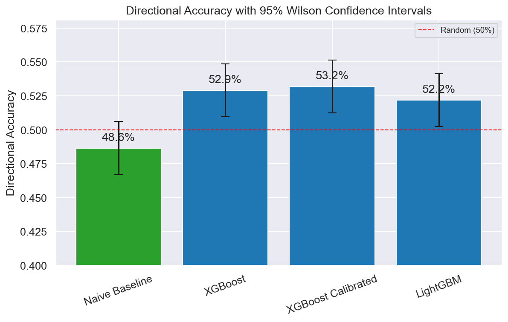
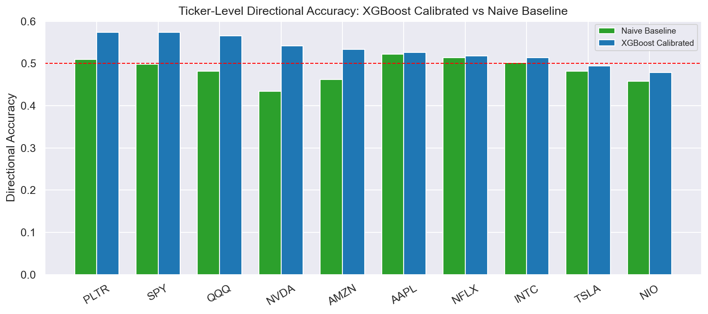
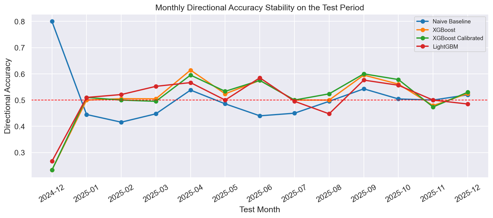
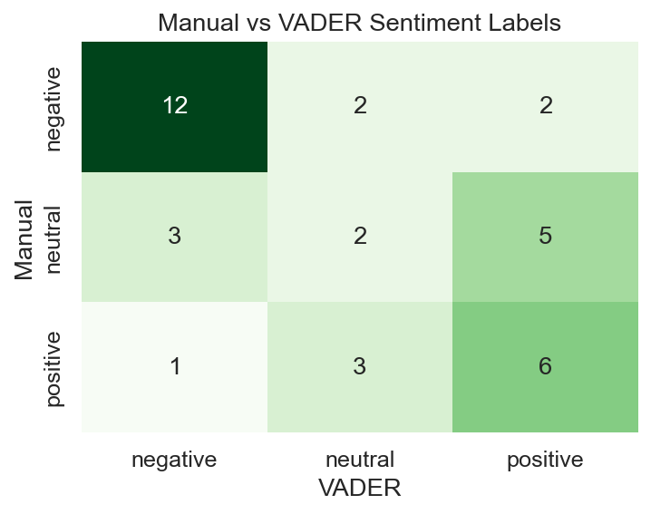

# Reddit Equity Forecast  v2.0

Predict next-day stock price percentage moves using Reddit sentiment + market features.

## Quick Start

```bash
# 1. Unzip and enter project
cd reddit_equity_forecast

# 2. Install dependencies
pip install -r requirements.txt
# OR: conda env create -f environment.yml && conda activate reddit_equity_forecast

# 3. Optional: add Reddit API credentials for the recent-tail PRAW supplement
cp .env.example .env
# Open .env and fill in REDDIT_CLIENT_ID and REDDIT_CLIENT_SECRET if you want PRAW

# 4. Run
python run_pipeline.py

# 5. Optional: enable FinBERT sentiment
python run_pipeline.py --use-finbert
```

No manual CSV placement is required. The default run uses archive Reddit sources plus VADER sentiment; PRAW and FinBERT are optional add-ons.

---

## Get Reddit API Credentials (one-time setup)

1. Go to https://www.reddit.com/prefs/apps
2. Click **Create App** → choose **script**
3. Copy `client_id` (below the app name) and `secret`
4. Paste into `.env`

---

## Data Collection Strategy

The pipeline collects **real Reddit data only** using 3 sources in order:

```
[1] Arctic Shift API  — free, no auth, real data 2020–present
      ↓ if unreachable
[2] PullPush.io API   — backup mirror, real data 2020–present
      ↓ if unreachable
[3] PRAW              — Reddit official API, optional recent-tail supplement
```

After collection, a **per-ticker per-year coverage table** is printed showing
exactly which years have good data, sparse data, or no data — honestly.

No fake data is ever generated. All rows are real Reddit posts and comments.

---

## Pipeline Stages

```
python run_pipeline.py
  Stage 1 → Validate configuration
  Stage 2 → Select top-10 tickers by 90-day trading volume    [Criterion 3]
  Stage 3 → Collect real Reddit data — 3-source fallback      [Criterion 2]
  Stage 4 → Score sentiment: VADER by default, FinBERT optional
  Stage 5 → Fetch OHLCV from Yahoo Finance + engineer features
  Stage 6 → Merge, lag 1 day, split 70% train / 10% val / 20% test
  Stage 7 → Train: Naive Baseline + XGBoost + XGBoost Calibrated + LightGBM
  Stage 8 → Generate PNG + interactive HTML plots
```

## Run Flags

```bash
python run_pipeline.py --force           # Ignore all caches, recompute everything
python run_pipeline.py --skip-reddit     # Use cached Reddit data (faster iteration)
python run_pipeline.py --skip-sentiment  # Market features only, skip sentiment
python run_pipeline.py --use-finbert     # Enable optional FinBERT scoring
```

## Integrity Checks

```bash
python -m unittest discover -s tests -v
```

These tests lock the most important thesis assumptions:
- Reddit rows are clipped to the configured study window
- sentiment is lagged by one day before modelling
- train / validation / test splits remain chronological with no overlap

## Refresh Thesis Outputs

```bash
python refresh_thesis_outputs.py
```

This regenerates the scored sentiment files, evaluation tables, thesis plots, manual sentiment appendix, and analysis report from the cached datasets and saved models.

## Project Structure

```
reddit_equity_forecast/
├── config.py                     # Central config — paths, constants, env vars
├── run_pipeline.py               # End-to-end runner
├── full_run.py                   # Alternative full-run entry point
├── refresh_thesis_outputs.py     # Fast thesis artifact refresh from cached data
├── generate_report.py            # Generate summary report from outputs
├── convert_all_parquet.py        # Convert cached Parquet files utility
├── export_to_excel.py            # Export results to Excel
├── check_coverage.py             # Check Reddit data coverage per ticker/year
├── check_raw_files.py            # Inspect raw collected data files
├── requirements.txt
├── environment.yml
├── .env.example                  ← Copy to .env, add your keys
├── src/
│   ├── ticker_selector.py        # 90-day volume ranking → top-N
│   ├── reddit_collector.py       # 3-source real data collection
│   ├── sentiment_engine.py       # VADER + optional FinBERT
│   ├── market_data.py            # yfinance OHLCV + RSI/MACD/BB features
│   ├── dataset_builder.py        # Merge, 1-day lag, 70/10/20 split
│   ├── models.py                 # Naive Baseline + XGBoost + calibrated XGBoost + LightGBM
│   ├── visualiser.py             # Core PNG + Plotly interactive HTML
│   ├── results_analyzer.py       # Thesis-oriented evaluation tables and plots
│   └── sentiment_validation.py   # Manual sentiment appendix generator
├── tests/
│   └── test_pipeline_integrity.py
├── notebooks/
│   └── reddit_equity_analysis.ipynb
├── docs/
│   └── results/                  # Committed charts and report snapshots for GitHub
├── data/                         # Auto-created on first run
│   └── validation/               # Manual sentiment review labels
├── models/                       # Auto-created on first run
└── outputs/                      # Auto-created on first run
```

## Models

| Model | Description |
|---|---|
| **Naive Baseline** | Yesterday's return — random-walk null hypothesis |
| **XGBoost** | Gradient-boosted trees, early stopping on val set |
| **XGBoost Calibrated** | XGBoost regression with a validation-tuned directional threshold |
| **LightGBM** | Leaf-wise boosting, early stopping on val set |

## Results Snapshot

Current held-out test results:
- `Naive Baseline`: MAE `0.02833`, RMSE `0.04170`, DA `48.6%`
- `XGBoost`: MAE `0.01984`, RMSE `0.03048`, DA `52.9%`
- `XGBoost Calibrated`: MAE `0.01984`, RMSE `0.03048`, DA `53.2%`
- `LightGBM`: MAE `0.01982`, RMSE `0.03045`, DA `52.2%`

The strongest thesis-ready evidence is in:
- `docs/results/model_analysis.txt`
- `docs/results/directional_accuracy_stats.csv`
- `docs/results/ticker_model_metrics.csv`
- `docs/results/monthly_model_metrics.csv`
- `docs/results/sentiment_validation_summary.txt`

### Model Comparison



### Directional Accuracy Confidence Intervals



### Stability by Ticker and Month





### Manual Sentiment Validation



## Acceptance Criteria

| # | Criterion | How it's met |
|---|---|---|
| 1 | Runs without manual tweaks | `python run_pipeline.py` works with cached/archive data; PRAW and FinBERT are optional |
| 2 | Real Reddit data only | 3-source fallback (Arctic Shift → PullPush → optional PRAW); no synthetic data |
| 3 | Coverage proof printed | Per-ticker per-year table shows exactly what was collected |
| 4 | Top-10 by trading volume | Full ranked table printed with ✓ marks |

## Outputs

| File | Description |
|---|---|
| `outputs/model_comparison.csv` | MAE / RMSE / DA for all 4 models |
| `outputs/directional_accuracy_stats.csv` | Wilson confidence intervals for directional accuracy |
| `outputs/ticker_model_metrics.csv` | Ticker-level MAE / RMSE / DA on the test split |
| `outputs/monthly_model_metrics.csv` | Month-by-month test-period stability metrics |
| `outputs/volume_ranking.png` | Top-10 ticker bar chart |
| `outputs/sentiment_timeseries.png` | VADER sentiment per ticker over time |
| `outputs/model_comparison.png` | Side-by-side model comparison |
| `outputs/directional_accuracy_ci.png` | Directional accuracy with 95% confidence intervals |
| `outputs/ticker_directional_accuracy.png` | Best model vs baseline by ticker |
| `outputs/monthly_directional_accuracy.png` | Monthly directional accuracy stability |
| `outputs/feature_importance.png` | Top-20 features per model |
| `outputs/predictions_scatter.png` | Actual vs predicted scatter |
| `outputs/residual_distribution.png` | Residual histogram for the best model |
| `outputs/direction_confusion.png` | Up/down confusion matrix for the best model |
| `outputs/sentiment_validation_sample.csv` | Reviewed manual sentiment sample |
| `outputs/sentiment_validation_confusion.png` | Manual vs VADER sentiment confusion matrix |
| `outputs/sentiment_interactive.html` | Interactive Plotly sentiment chart |
| `outputs/predictions_interactive.html` | Interactive Plotly predictions |
| `outputs/pipeline.log` | Full debug log |

## Known Limitations

- Reddit API officially covers only the recent tail directly. Older coverage depends
  on Arctic Shift / PullPush availability, and sparse periods are reported rather than filled
- FinBERT is optional because first-time model download is large and can slow a clean setup
- Reddit sentiment = correlation, not causation
- Transaction costs and slippage not modelled
- Walk-forward backtesting recommended before live deployment
